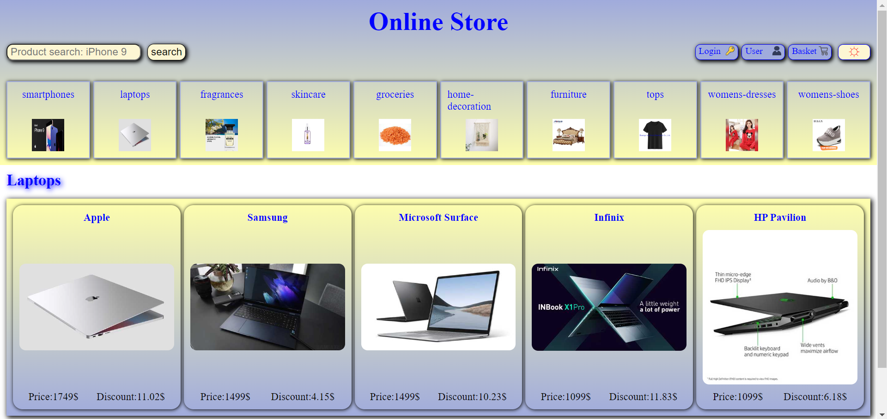
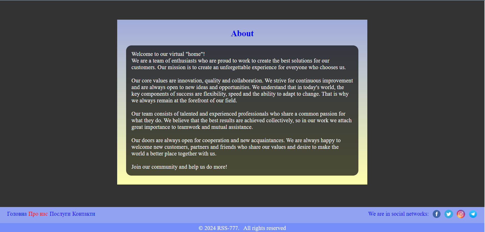
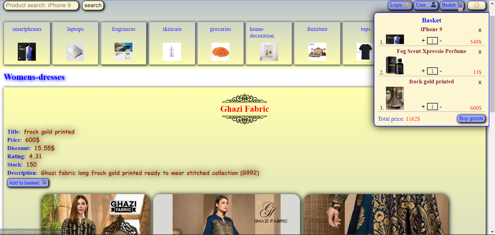

# Internet-shop

>This  online store is a place where you can find and buy a variety of products at your convenience. From clothing to electronics and home goods to hardware!

# Basic functions
* **Properties:** Product categories: Products are divided into categories for ease of navigation.
* **Search and filter:** You can quickly find the product you need using the search and filter function.
* **Add to cart:** Conveniently add products to the shopping cart.
* **Placing an order:** A simple process of placing an order with the delivery address and other important data.
* **Payment and delivery:** Various payment methods and delivery options for the convenience of customers.

### Tech stack
* [X] **React**: *JavaScript-library* for building user interfaces.
* [X] **Vite**: Fast and advanced web application development tool.
* [X] **React Router**: Library for navigating and managing pages in *React* applications.
* [X] **TypeScript**: We use TypeScript to generate typed JavaScript code, which allows us to make our code more secure and understandable.
* [X] **React Hook Form**: Is a react library that provides a simple and efficient way to manage forms in React. We use it to create and validate forms in our online store.
* [X] **Yup**: Yup is a JavaScript data validation library that allows us to set validation rules for various fields in our forms. We use Yup along with React Hook Form to provide validation of user input.
* [X] **styled-components**: Styled-components is a React component styling library that allows us to write CSS in JavaScript. We use styled-components to create a beautiful and modular design for our online store.
* [X] **dotenv**: dotenv is a module for storing sensitive information and settings in environment variables. We use dotenv to securely store sensitive data such as API keys and other settings.
* [X] **gh-pages**: gh-pages is an npm package that allows us to publish our website to GitHub Pages. We use gh-pages to publish our online store online for quick and easy access.
* [X] **react-slick**: react-slick is a library for creating beautiful and responsive carousels in React. We use react-slick to create dynamic and attractive sliders for our products and promotions.
* [X] **Redux**: Is a library for managing application state in React. We use Redux to store and manage global application state, such as the list of items in the cart and other important data.
* [X] **EmailJS**: Is a service that allows you to send emails from your client's website without using your own server. It provides a simple API for sending emails via JavaScript, making it easy and quick to integrate email functionality into your app or website.
___
[Link to the site with the *Internet-shop*](https://rss-777.github.io/internet-shop/)

___
### Screenshot

    
     
    
    

